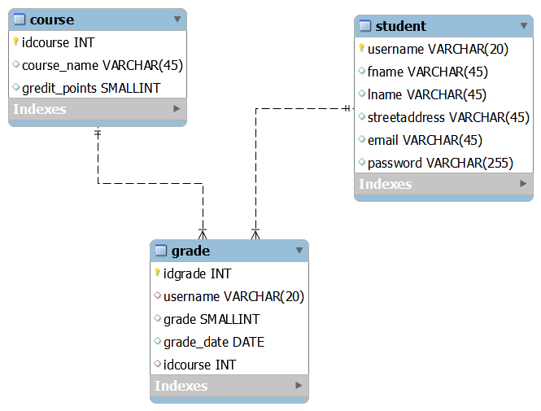

# university

Tämä on esimerkkisovellus pankkiprojektia varten keväällä 2024.

## Sovelluksen käyttöliittymä

Tarkoitus on tehdä seuravanlainen sovellus.

## Tietokannan suunnittelu

Hahmottelin tietokannan ER-kaaviota seuraavasti:

Lopullinen diagrammi on seuraava:

## .env

Tiedostoon voidaan kirjoittaa ns. "environment muuttujia".
Jotta tiedostoa voidaan käyttää tarvitaan dotenv moduuli ja sitten seuraavat rivit
<pre>
const dotenv=require('dotenv');
dotenv.config();
</pre>

.env:tä ei pidä viedä GitHubiin, jos repo on public-tyyppinen.
Usein tehdään kuitenkin tiedosto env_example, jossa kerrotaan mitä .env tiedostoon tulee lisätä jotta sovellus toimii.

## Sovelluksen käyttöönotto

Jos haluat kokeilla sovellusta sinun tulee tehdä seuraavat toimenpiteet.

<ol>
<li>Kloonaa tämä repository</li>
<li>Kopioi backend kansion tiedosto env_example tiedostoksi .env</li>
<li>Importtaa MySQL Workbenchissä tiedosto database_dump.sql. Voit ajaa dumpin myös komentoriviltä komennolla
<pre>
mysql -u root -p < database_dump.sql
</pre>
</li>
<li>Suorita kansiossa backend komento npm install</li>
<li>Käynnistä backend sovellus komennolla npm start</li>
</ol>