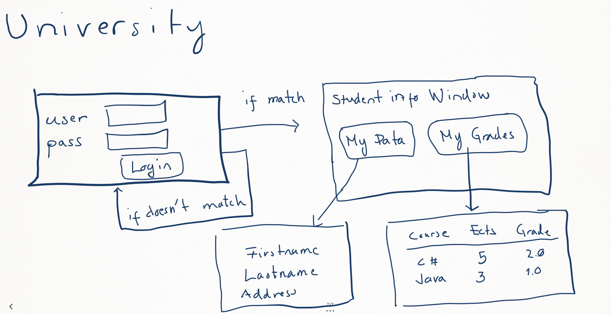

# university

Tämä on esimerkkisovellus pankkiprojektia varten keväällä 2024.

## Sovelluksen käyttöliittymä

Tarkoitus on tehdä seuravanlainen sovellus.

## Tietokannan suunnittelu

Hahmottelin tietokannan ER-kaaviota seuraavasti:

Lopullinen diagrammi on seuraava:

## .env

Tiedostoon voidaan kirjoittaa ns. "environment muuttujia".
Jotta tiedostoa voidaan käyttää tarvitaan dotenv moduuli ja sitten seuraavat rivit
<pre>
const dotenv=require('dotenv');
dotenv.config();
</pre>

.env:tä ei pidä viedä GitHubiin, jos repo on public-tyyppinen.
Usein tehdään kuitenkin tiedosto env_example, jossa kerrotaan mitä .env tiedostoon tulee lisätä jotta sovellus toimii.